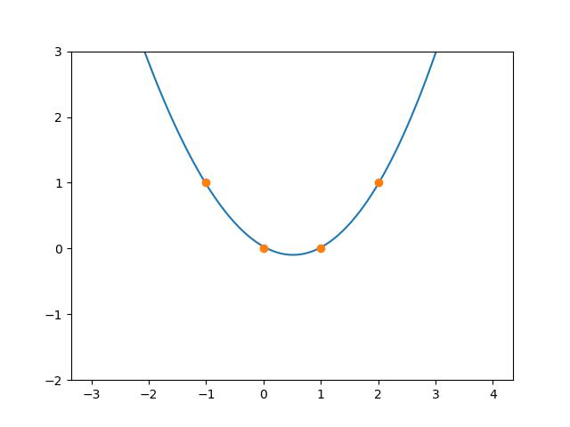

# 4Points
## Description
Finding the values of coefficients of 3rd degree equation that passes through the 4 points that we have given. This is achived by using gradient descent and increasing learing rate exponentially (to decrease the number of iteration and get faster training).

## Formula

$y = ax^3+bx^2+cx+d$, we have to find the $a, b, c, d$

Here 4 variables are there, so we should have 4 equations to solve it, to get 4 equations, we need 4 points and substituting these points on the above equation to get 4 equations.

Let us take 4 points $(x_1, y_1), (x_2, y_2), (x_3, y_3), (x_4, y_4)$. Substitute these points in above equation. We get,

- $y_1 = ax_1^3+bx_1^2+cx_1+d$
- $y_2 = ax_2^3+bx_2^2+cx_2+d$
- $y_3 = ax_3^3+bx_3^2+cx_3+d$
- $y_4 = ax_4^3+bx_4^2+cx_4+d$

We can convert this equation into Matrix,

$$
\begin{bmatrix}
y_1\\
y_2\\
y_3\\
y_4
\end{bmatrix}  = 
\begin{bmatrix}
x_1^3 & x_1^2 & x_1 & 1\\
x_2^3 & x_2^2 & x_2 & 1\\
x_3^3 & x_3^2 & x_3 & 1\\
x_4^3 & x_4^2 & x_4 & 1\\
\end{bmatrix}.
\begin{bmatrix}
a\\
b\\
c\\
d
\end{bmatrix}\\
$$

$$
Y = A.W
$$

### Loss
Let us take $Y$ as true value and $\hat{Y}$ as predicted value.

$$loss = {1 \over N}\sum(Y-\hat{Y})^2$$

### Gradient

$$
{d(loss) \over dW} = {d \over dW}\left[{1 \over N}\sum(Y-\hat{Y})^2\right]
$$

$$
{d(loss) \over dW} = {1 \over N}{d \over dW}\left[\sum(Y-\hat{Y})^2\right]
$$

$$
{d(loss) \over dW} = {1 \over N}{d \over dW}\left[\sum(Y-A.W)^2\right]
$$

$$
{d(loss) \over dW} = {1 \over N}{d \over dW}\sum\left(
\begin{bmatrix}
y_1\\
y_2\\
y_3\\
y_4
\end{bmatrix}
-\begin{bmatrix}
x_1^3 & x_1^2 & x_1 & 1\\
x_2^3 & x_2^2 & x_2 & 1\\
x_3^3 & x_3^2 & x_3 & 1\\
x_4^3 & x_4^2 & x_4 & 1\\
\end{bmatrix}
.\begin{bmatrix}
a\\
b\\
c\\
d
\end{bmatrix}
\right)^2
$$

$$
{d(loss) \over dW} = {1 \over N}{d \over dW}\sum\left(
\begin{bmatrix}
y_1-ax_1^3-bx_1^2-cx_1-d\\
y_2-ax_2^3-bx_2^2-cx_2-d\\
y_3-ax_3^3-bx_3^2-cx_3-d\\
y_4-ax_4^3-bx_4^2-cx_4-d
\end{bmatrix}
\right)^2
$$

$$
{d(loss) \over dW_n} = {1 \over 4}{d \over dW_n}\left(
\begin{matrix}
[y_1-ax_1^3-bx_1^2-cx_1-d]^2\\
+[y_2-ax_2^3-bx_2^2-cx_2-d]^2\\
+[y_3-ax_3^3-bx_3^2-cx_3-d]^2\\
+[y_4-ax_4^3-bx_4^2-cx_4-d]^2\\
\end{matrix}\right)
$$

Let us take $W_n = a$

$$
{d(loss) \over d(a)} = {1 \over 4}\left(
\begin{matrix}
2[y_1-ax_1^3-bx_1^2-cx_1-d][-x_1^3]\\
+2[y_2-ax_2^3-bx_2^2-cx_2-d][-x_2^3]\\
+2[y_3-ax_3^3-bx_3^2-cx_3-d][-x_3^3]\\
+2[y_4-ax_4^3-bx_4^2-cx_4-d][-x_4^3]\\
\end{matrix}\right)
$$

$$
{d(loss) \over d(a)} = {1 \over 2}A_{col1}^T.(Y-\hat{Y})
$$

Let us take $W_n = b$

$$
{d(loss) \over d(b)} = {1 \over 4}\left(
\begin{matrix}
2[y_1-ax_1^3-bx_1^2-cx_1-d][-x_1^2]\\
+2[y_2-ax_2^3-bx_2^2-cx_2-d][-x_2^2]\\
+2[y_3-ax_3^3-bx_3^2-cx_3-d][-x_3^2]\\
+2[y_4-ax_4^3-bx_4^2-cx_4-d][-x_4^2]\\
\end{matrix}\right)
$$

$$
{d(loss) \over d(b)} = {1 \over 2}A_{col2}^T.(Y-\hat{Y})
$$

Let us take $W_n = c$

$$
{d(loss) \over d(c)} = {1 \over 4}\left(
\begin{matrix}
2[y_1-ax_1^3-bx_1^2-cx_1-d][-x_1]\\
+2[y_2-ax_2^3-bx_2^2-cx_2-d][-x_2]\\
+2[y_3-ax_3^3-bx_3^2-cx_3-d][-x_3]\\
+2[y_4-ax_4^3-bx_4^2-cx_4-d][-x_4]\\
\end{matrix}\right)
$$

$$
{d(loss) \over d(c)} = {1 \over 2}A_{col3}^T.(Y-\hat{Y})
$$

Let us take $W_n = d$

$$
{d(loss) \over d(d)} = {1 \over 4}\left(
\begin{matrix}
2[y_1-ax_1^3-bx_1^2-cx_1-d][-1]\\
+2[y_2-ax_2^3-bx_2^2-cx_2-d][-1]\\
+2[y_3-ax_3^3-bx_3^2-cx_3-d][-1]\\
+2[y_4-ax_4^3-bx_4^2-cx_4-d][-1]\\
\end{matrix}\right)
$$

$$
{d(loss) \over d(d)} = {1 \over 2}A_{col4}^T.(Y-\hat{Y})
$$

Finally, We get ${W'}$

$$
W' = {1 \over 2}\begin{bmatrix}
A_{col1}^T.(Y-\hat{Y})\\
A_{col2}^T.(Y-\hat{Y})\\
A_{col3}^T.(Y-\hat{Y})\\
A_{col4}^T.(Y-\hat{Y})\\
\end{bmatrix}
$$

## Code
Getting all the inputs
```python
n      = int(request.form.get('iterations'))
base   = int(request.form.get('base'))
power  = int(request.form.get('power'))
lr     = float(request.form.get('lr'))
points = request.form.get('points')
fps    = int(request.form.get('fps'))
```
Modifying `points`
```python
points = points.replace(' ', '')
points = points.split('|')
points = [list(map(float,i.split(','))) for i in points]
```
$A$ matrix
```python
A = np.array([
    [points[0][0]**3, points[0][0]**2, points[0][0], 1],
    [points[1][0]**3, points[1][0]**2, points[1][0], 1],
    [points[2][0]**3, points[2][0]**2, points[2][0], 1],
    [points[3][0]**3, points[3][0]**2, points[3][0], 1],
])
```
$W$ matrix
```python
W = np.zeros((len(points), 1))
```
$Y$ matrix
```python
Y = np.array(points)[:, 1].reshape(-1, 1)
```
$W'$ Matrix
```python
def delta(A, W, Y, lr):
    return -lr*np.array([(2*A[:, 0].reshape(-1, 1)*(Y - A@W)).mean(), 
                        (2*A[:, 1].reshape(-1, 1)*(Y - A@W)).mean(), 
                        (2*A[:, 2].reshape(-1, 1)*(Y - A@W)).mean(), 
                        (2*A[:, 3].reshape(-1, 1)*(Y - A@W)).mean()]).reshape(-1, 1)
```
Loss
```python
def loss(A, W, Y):
    return ((Y - A@W)**2).mean()
```
$y = ax^3+bx^2+cx+d$
```python
def func(x, W):
    return (np.array([[x**3, x**2, x, 1]])@W)[0][0]
```
lr2
```python
lr2 = np.linspace(1, np.power(base, 1/power), n)**power
```
> `lr2` is used to minimize the loss faster by increasing Learning rate `lr`. I used this lr2, because the loss decreasing faster in starting but the decreasing rate of loss is decreasing to tackle this problem I used lr2 to increase the learning rate at iterations going, this will increase the rate of decreasing of loss.

Finding the optimal $W$ by using gradient descent
```python
for i in range(n):
    W = W - lr2[i]*delta(A, W, Y, lr)
    print(loss(A, W, Y))
```
Graph video
```python
x = np.linspace(np.array(points)[:, 0].min()-2,
                np.array(points)[:, 0].max()+2, 100)

y = [func(i, W) for i in x]
x_y = [[i[0] for i in points], [i[1] for i in points]]

writer = imageio.get_writer('static/graph.mp4', fps=fps)

plt.ylim(Y.min()-2, Y.max()+2)

plt.plot(x, y)
plt.plot(*x_y, 'o')
plt.savefig('image.jpg')
plt.close()
image = imageio.imread('image.jpg')
writer.append_data(image)
# writer.close()
```
> Runing this code inside the loop of gradient descent we can get `graph.mp4`

Flask app
```python
from flask import Flask, render_template, request
import matplotlib.pyplot as plt
import numpy as np
import imageio
import json

app = Flask(__name__)
@app.route('/', methods=['POST', 'GET'])
def home():
    # code ...
    return render_template('index.html', loss=l, data=data)

if __name__ == '__main__':
    app.run()
```
`index.html`
```html
<!-- form -->
<form action="/" method="POST">
    <input type="text" name="iterations" placeholder="iterations"><br>
    <input type="text" name="base" placeholder="base"><br>
    <input type="text" name="power" placeholder="power"><br>
    <input type="text" name="lr" placeholder="lr"><br>
    <input type="text" name="points" placeholder="points"><br>
    <input type="text" name="fps" placeholder="FPS"><br>
    <input type="submit">
</form>

<!-- video -->
<video controls style="float: left;">
    <source src="/static/graph.mp4" type="video/mp4">
</video>

<!-- Sample data table -->
<h1>Sample Data</h1>
<table>
    
    <tr><th>{{i}}: </th><td>{{data[i]}}</td></tr>
    
</table>

<!-- fill sample data button -->
<button onclick="autofill()">Auto fill Sample Data</button>

<!-- fill sample data button js code -->
<script>
    function autofill(){
        document.getElementsByName('iterations')[0].value = 100;
        document.getElementsByName('base')[0].value = 10;
        document.getElementsByName('power')[0].value = 3;
        document.getElementsByName('lr')[0].value = 0.01;
        document.getElementsByName('points')[0].value = '0,0|1,0|-1,1|2,1';
        document.getElementsByName('fps')[0].value = 30;
    }
</script>
```
`data.js`
```python
{
    "n": 100,
    "base": 10,
    "power": 3,
    "lr": 0.01,
    "points": "0,0|1,0|-1,1|2,1"
}
```
Output


